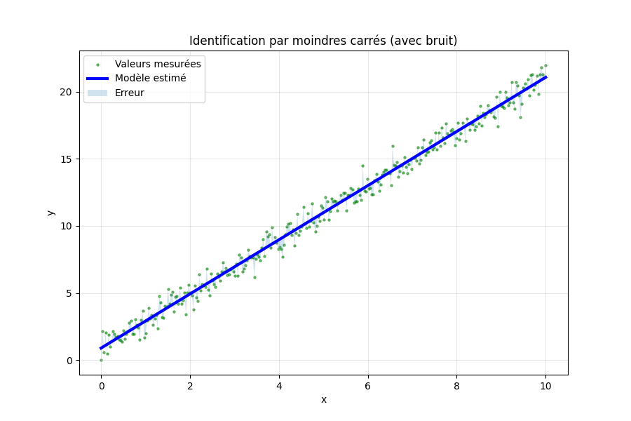

# Asservissement_Numerique_RAKOTOMAMONJY_Elisa__Projet14
Identification de système par moindres carrés - Python (SciPy)
# Description
Ce projet présente l’identification d’un système linéaire à partir de données bruitées en utilisant la méthode des **moindres carrés**.

L’objectif est d’estimer les paramètres d’un modèle mathématique afin d’approcher le comportement réel d’un système.

## Méthode utilisée

On considère un modèle linéaire du type :

y(t) = a t + b

Le problème est formulé sous forme matricielle :

Y = A X

La solution des moindres carrés est donnée par :

X = (Aᵀ A)⁻¹ Aᵀ Y

Cette méthode permet d’obtenir la meilleure approximation
## Contenu du projet

- `main.py` → code principal d’identification
- `requirements.txt` → dépendances Python
- `Rapport_RAKOTOMAMONJY_Elisa_Projet14.pdf` → rapport détaillé
- `README.md` → documentation du projet

  
## Exécution

### 1. Installer Python
Vérifier que Python est installé en ouvrant l’invite de commande (cmd) et en tapant :

python --version

### 2. Télécharger le projet

- Cliquer sur **Code > Download ZIP**
- Extraire le dossier sur votre ordinateur

### 3. Installer les dépendances

Ouvrir l’invite de commande dans le dossier du projet, puis taper :

pip install -r requirements.txt

### 4. Lancer le programme

Toujours dans le même dossier, taper :

python main.py

### 5. Résultat attendu

Après exécution :

- Un graphique s’affiche (données et modèle)
- Les paramètres (a, b) sont affichés
- Une image peut être enregistrée (resultat.png)
- ## 📷 Résultat

###  Problèmes fréquents

- Si `python` ne marche pas → essayer : python3
- Si `pip` ne marche pas → essayer : pip3
- Vérifier que vous êtes dans le bon dossier
